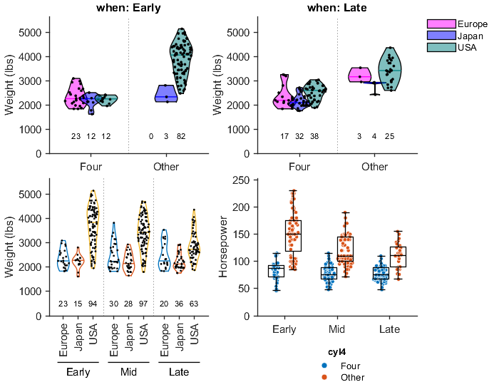

# grpandplot: An open-source MATLAB tool for drawing box plot and violin plot with automatic multi-way data grouping.

Man Ho Wong, 2022.

## Introduction

`grpandplot` features data grouping by multiple factors, supporting up to three-way grouping. Different combination of data objects (i.e. scatter (data points, box plot, violin plot, n number) can be plotted on top of each other with size and position automatically adjusted. This function is compatible with MATLAB's plotting syntax and can be combined with other MATLAB Graphics objects, such as `Figure`, `TiledChartLayout`  and `Axes`.  Moreover, figures are fully configurable with MATLAB's graphics methods and properties.

### Features:

- Multi-way data grouping up to three factors
- Data can be grouped and displayed as groups along x-axis, of different colors and/or in separate tiles (i.e. axes) in the same figure
- Available data objects: scatter, box plot, violin plot, n number
- Data points jittered according to their PDF
- Different combinations of data objects allowed
- Size and position of data objects automatically adjusted
- Options available for adjust color, size and position
- Compatible with MATLAB's Graphics objects such as `Figure`, `TiledChartLayout`  and `Axes`
- Figures configurable via MATLAB's graphics methods and properties

## Installation

Requirement: MATLAB R2020b or above (Versions supporting `swarmchart`)

You can download the directory `grpandplot` directly to you computer or install via MATLAB's Add-On Explorer.

## Usage

See documentation ([grpandplot_doc.mlx](resources/grpandplot_doc.mlx) or [grpandplot_doc.pdf](resources/grpandplot_doc.pdf)).

## License

This tool contains a modified version of `violin.m` created by Jasper Fabius (2019). The copyright notice can be found [here](violin/violin_license.txt). Modification is documented in the function file `violin.m`.

This project is licensed under [GNU General Public License v3.0](LICENSE).

## Cite As

Wong, M. H. (2022). grpandplot: An open-source MATLAB tool for drawing box plot and violin plot with automatic multi-way data grouping. (Version 1.0.0) [Computer software]. https://doi.org/10.5281/zenodo.7295877

